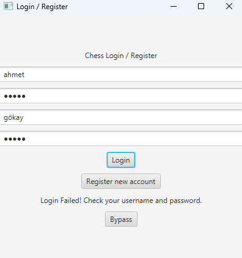
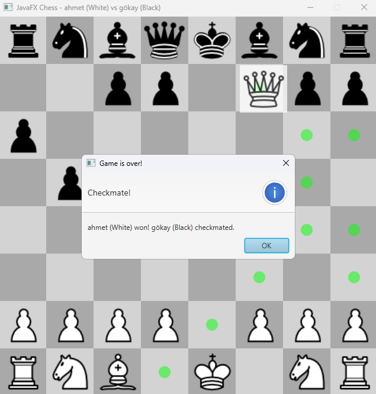

# Chess ProjectFX

**Chess ProjectFX** is a fully-featured, two-player desktop chess game built with JavaFX. It implements all official FIDE rules, provides a modern GUI, user authentication, persistent statistics, and convenient game controls.

## Features

  - **Complete Chess Logic**

      - Pawn, Rook, Knight, Bishop, Queen, King movements
      - Special moves: Castling, Pawn Promotion
      - Automatic Check & Checkmate detection

  - **Intuitive GUI**

      - Drag-and-drop or click-to-move method
      - Highlighting legal moves for the selected piece
      - Customizable theme and icons

  - **User Management & Persistence**

      - Register / Login screen
      - Storing player statistics (win count, etc.) in `users.txt`
      - Ability to undo the last move with the "Undo" function

## Prerequisites

  - Java Development Kit (JDK) **11+**
  - JavaFX SDK (compatible with your JDK)
  - Maven **3.6+** (or Gradle, as preferred)
  - IDE: IntelliJ IDEA

## Installation & Run

1.  Clone the repository:

    ```bash
    git clone https://github.com/ahmttdmr/Chess_ProjectFX.git
    ```
2. After cloning this repo, open the project in your IDE.
3. Navigate to "ChessApp.java" and run the app.
   


## Usage

1.  When the application opens, create a new user with "Register" or log in with an existing one using "Login".
2.  Select a piece on the board; valid moves are automatically highlighted.
3.  Move the piece using drag-and-drop or click-to-click.
4.  If necessary, undo the last move with the "Undo" button.

## Project Structure

```
src/
└── main/
    ├── java/com/example/satranc2/
    │   ├── ChessApp.java         ← Main application class
    │   ├── Piece.java            ← Base class for all pieces
    │   ├── Pawn.java             ← Pawn movement rules
    │   ├── Rook.java             ← Rook movement rules
    │   ├── Knight.java           ← Knight movement rules
    │   ├── Bishop.java           ← Bishop movement rules
    │   ├── Queen.java            ← Queen movement rules
    │   ├── King.java             ← King movement rules
    │   ├── BoardManager.java     ← Board creation and updating
    │   ├── MoveManager.java      ← Move validation check
    │   ├── LoginScreen.java      ← Login/Register UI and operations
    │   ├── UserManager.java      ← User data reading/writing
    │   ├── UserStatsManager.java ← Storing statistics
    │   └── MoveRecord.java       ← Move recording for Undo
    └── resources/
        ├── fxml/                 ← FXML files
        └── images/               ← Piece and icon images
```

## Screenshots







